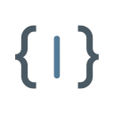

# OpenAPI UI（openapi-ui-vue）

基于 **Vue 3 + Vite + TypeScript** 的 OpenAPI 接口调试工作台：导入 OpenAPI 3.x / Swagger 2.0 规范后，
即可像 Postman 一样浏览接口、编辑请求、管理集合与变量、批量运行，并一键生成多语言请求代码与
客户端 SDK。所有工作区数据本地持久化，无需登录、无后端依赖。

<p align="center">
  
</p>

---

## 目录

- [功能特性](#功能特性)
- [技术栈](#技术栈)
- [环境要求](#环境要求)
- [快速开始](#快速开始)
- [环境变量配置](#环境变量配置)
- [运行模式](#运行模式)
- [脚本命令](#脚本命令)
- [项目结构](#项目结构)
- [测试](#测试)
- [开源协议](#开源协议)

---

## 功能特性

### 规范导入与解析

- 支持 **OpenAPI 3.x** 与 **Swagger 2.0** 文档，JSON / YAML 均可。
- 支持从 **URL** 或 **本地文件** 导入规范（`ImportSpec`），也支持直接内嵌 `data:` 文档。
- 完整的 `$ref` 递归解析（含 `~0` / `~1` 转义），自动展开 Path Item 与 Operation 级参数合并。
- 收到 HTML 而非规范文档时给出明确的排错提示（通常是 `VITE_API_BASE_URL` / `VITE_SPEC_PATH` 配置错误）。

### 请求调试

- 多标签页（Tabs）工作区，标签可关闭、可持久化，右键菜单支持批量操作。
- 参数 / 请求头 / 表单均可视化键值编辑（`KeyValueEditor`），支持启用开关、文件上传标记。
- 请求体支持 JSON / 表单等多种 `contentType`，内置 **Monaco Editor** 代码编辑与高亮。
- 响应展示状态码、耗时、响应体大小、响应头，二进制响应以 Blob 处理可下载。
- 收藏（Favorites）与按 HTTP 方法筛选、请求搜索。

### 鉴权（Authorization）

- 自动识别规范中的 `securitySchemes`，支持：
  - **Basic Auth**（用户名 / 密码）
  - **API Key**（header / query / cookie）
  - **Bearer Token**
  - **OAuth 2.0**：`implicit`、`password`、`client_credentials`、`authorization_code` 四种流，
    支持 Client Secret 与 Scope 配置，自动换取并缓存 Access Token（含过期时间）。
- 凭据按规范隔离存储，可一键启用 / 停用。

### 集合与运行器（Runner）

- 将任意请求保存进**集合（Collection）**，集合可导入 / 导出，支持设置请求间延迟。
- **集合运行器**：批量顺序执行整个集合并汇总结果，适合回归冒烟测试。
- 运行**历史记录**自动保留（上限 100 条），可回填请求参数。

### 变量系统

- 工作区级**变量表**，请求参数、请求头、请求体中可通过占位符引用。
- 请求执行后的**输出（outputs）**可回写为变量，供后续请求链式使用（如先登录取 token）。

### 代码生成

- 单请求代码片段一键生成：**cURL**、**JS/TS (Fetch)**、**Python (requests)**、**C# (HttpClient)**、**Java (OkHttp)**。
- 内置客户端 SDK 生成器：
  - **C# API Client**（`csharpApiClientGenerator`）
  - **JavaScript API Client**（`javascriptApiClientGenerator`）

### 其他

- **接口概览（Overview）**：Markdown 文档渲染（`marked` + `DOMPurify` 消毒，防 XSS）。
- **多语言**：English / 简体中文 / 繁體中文（vue-i18n，自动跟随并支持手动切换）。
- **主题**：跟随系统 / 浅色 / Dark+ 等多套配色。
- **工作区持久化**：Tabs、历史、收藏、变量、集合、鉴权凭据按规范标识（URL 或 `info.title + version`）
  存入 `localStorage`，带版本号校验与结构合法性检查，损坏数据自动回退。
- **开发代理**：内置 `/api-proxy` 代理转发，规避浏览器跨域限制。
- 支持 **JSONPath** 查询，便于在响应中定位数据。

---

## 技术栈

| 分类 | 技术 |
| --- | --- |
| 框架 | Vue 3.5（Composition API）+ TypeScript 5.7 |
| 构建 | Vite 6 + vue-tsc |
| 状态管理 | Pinia 2 |
| 国际化 | vue-i18n 10 |
| 编辑器 | Monaco Editor（@guolao/vue-monaco-editor） |
| 工具库 | @vueuse/core、js-yaml、jsonpath-plus、marked、DOMPurify、lucide-vue-next |
| 测试 | Vitest 4 + @vue/test-utils + jsdom |
| 代码规范 | ESLint 9 + eslint-plugin-vue + @typescript-eslint |

---

## 环境要求

- **Node.js ≥ 22.12.0**（`engines` 字段已声明）
- npm（随 Node 安装）

---

## 快速开始

```bash
# 1. 安装依赖
npm install

# 2. 复制环境变量模板并按需修改
cp .env.example .env

# 3. 启动开发服务器（默认 http://127.0.0.1:5173）
npm run dev
```

构建生产版本：

```bash
npm run build:prod
# 产物输出至 dist/
npm run preview   # 本地预览构建产物
```

> `public/swagger.json` 是仓库自带的示例规范，未配置远程 API 时可用于体验全部功能。

---

## 环境变量配置

所有配置项通过 `.env` 文件（或 `.env.<mode>` 覆盖）注入，模板见 `.env.example`：

| 变量 | 说明 | 示例 |
| --- | --- | --- |
| `VITE_API_BASE_URL` | 后端 API 地址。**非空时**开发服务器会启用 `/api-proxy` 代理到该地址，规避跨域 | `http://localhost:8011/` |
| `VITE_SPEC_PATH` | OpenAPI 规范路径（相对 API 地址），默认 `/v3/api-docs`（Spring Boot 默认文档路径） | `/openapi/v1.json` |
| `VITE_SPEC_NAME` | 规范显示名称，留空则使用文档 `info.title` | `My API` |

典型配置：

```dotenv
# Spring Boot 项目
VITE_API_BASE_URL=http://localhost:8011/
VITE_SPEC_PATH=/v3/api-docs
VITE_SPEC_NAME=My API
```

- 不配置 `VITE_API_BASE_URL` 时，应用直接从 `VITE_SPEC_PATH` 拉取规范（需该路径允许跨域，
  或使用 `public/` 下的静态文件）。
- 运行时也支持在页面中从**本地文件**或**粘贴内容**导入规范，无需预先配置。

---

## 运行模式

项目内置多套 Vite 模式，对应不同的 `.env.<mode>` 文件：

| 脚本 | 模式 | 用途 |
| --- | --- | --- |
| `npm run dev` / `dev:test` / `dev:prod` / `dev:local` | development / test / production / local | 本地开发，加载对应环境配置 |
| `npm run build` / `build:test` / `build:prod` | 同上 | 构建对应环境的产物 |

---

## 脚本命令

| 命令 | 说明 |
| --- | --- |
| `npm run dev` | 启动开发服务器（127.0.0.1:5173） |
| `npm run build` | 类型检查 + 生产构建（`vue-tsc --noEmit && vite build`） |
| `npm run preview` | 预览构建产物 |
| `npm run test` | 运行单元测试（Vitest 单次执行） |
| `npm run test:watch` | 以 watch 模式运行测试 |
| `npm run typecheck` | 仅执行 TypeScript 类型检查 |
| `npm run lint` | ESLint 检查并自动修复 |

---

## 项目结构

```
openapi-ui-vue/
├── public/                  # 静态资源（应用图标、示例 swagger.json）
├── src/
│   ├── components/
│   │   ├── Authorization.vue    # 鉴权面板（Basic / API Key / Bearer / OAuth2）
│   │   ├── ImportSpec.vue       # 规范导入（URL / 文件 / 粘贴）
│   │   ├── RequestView.vue      # 请求编辑与响应展示
│   │   ├── RequestTabContextMenu.vue  # 标签页右键菜单
│   │   ├── Runner.vue           # 集合运行器
│   │   ├── Workspace.vue        # 工作区主布局（标签页 / 导航 / 主题 / 语言）
│   │   ├── tools/               # 工具面板（集合 / 历史 / 概览 / 变量）
│   │   └── ui/                  # 通用 UI 组件（Monaco 封装、键值编辑器、Modal 等）
│   ├── composables/             # 组合式函数（useWorkspace）
│   ├── i18n/                    # 国际化（en / zh-CN / zh-TW）
│   ├── lib/
│   │   ├── api.ts               # 规范解析、$ref 展开、Operation 提取
│   │   ├── codeSnippets.ts      # cURL / Fetch / Python / C# / Java 代码片段生成
│   │   ├── generators/          # C# 与 JavaScript 客户端 SDK 生成器
│   │   ├── oauth.ts             # OAuth2 各流式的令牌获取与刷新
│   │   └── workspace.ts         # 工作区持久化（版本校验 / 数据合法性检查）
│   ├── styles/                  # 全局样式
│   ├── types.ts                 # 核心类型定义
│   └── main.ts                  # 入口
├── .env.example             # 环境变量模板
├── vite.config.ts           # Vite 配置（别名 @、/api-proxy 代理、规范 URL 注入）
└── package.json
```

---

## 测试

测试基于 Vitest + jsdom，覆盖规范解析、工作区持久化等核心逻辑：

```bash
npm run test          # 单次运行
npm run test:watch    # 监听模式
```

---

## 开源协议

本项目基于 [MIT License](LICENSE) 开源。

Copyright (c) 2026 Viken Wang
